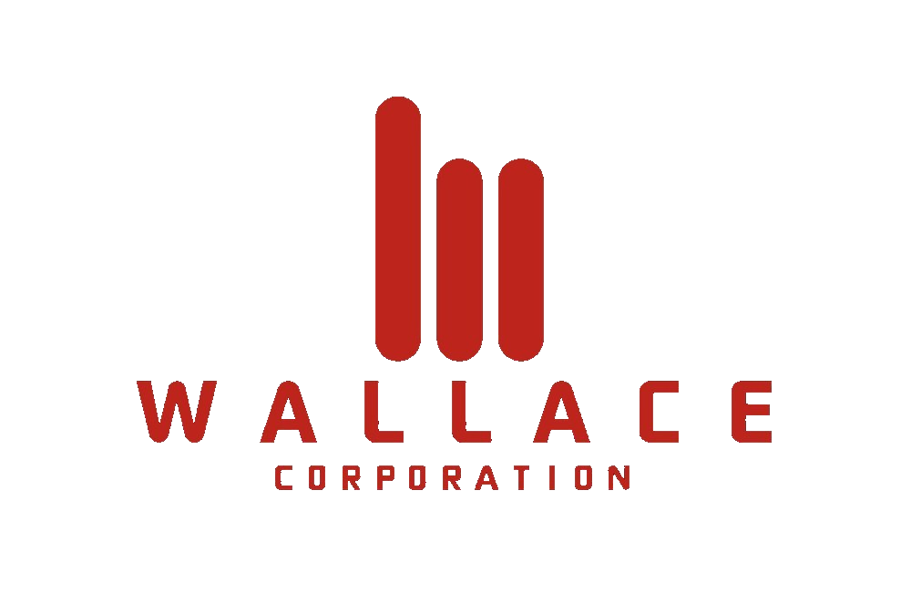

# Wallace Corporation

  

# Contributors

[Luci Pak](https://github.com/lucipak "Luci Pak")

[Jesse Smith](https://github.com/jessesmith-13 "Jesse Smith")

[Adam Whitman](https://github.com/emagdaeh "Adam Whitman")

# Introduction

Wallace Corporation is a front-end redesign for an e-commerce website specializing in clothing and apparel.  The stated that the website needed to have a product overview, a questions & answers section, and a ratings & reviews section.  The product overview section provides a main display with an image carousel of thumbnail images for the current style.  Each product also comes with multiple styles and the user can select individual styles with thumbnail button images.  Each product's important info is also displayed (i.e. name, price, style, description, etc.).  Finally, the product overview includes a size and quantity selector and an add to cart button for the user to store products they intend to purchase.

The questions and answers section provides the user with the ability to post and read questions about a product as well as the ability to answer questions other users have posted.  The user has the ability to add images to their questions to give context to the questions being asked.  The company employees can also answer questions with a designation to let all users see that the question was answered by an employee of the companty.  Questions and answers are also filterable to help the user get to the information most relevant to them.

The ratings and reviews section displays the average rating for each product, specific metrics used to rate a product (i.e. size, fit, length, etc.).  The user is able to post their own reviews as well as photos of what they are reviewing.  Ratings and reviews are also searchable similar to the questions and answers section.

# Tech Stack
<ul>
<li>React</li>
<li>Express</li>
<li>Node.js</li>
<li>Axios</li>
<li>CSS Modules</li>
<li>Bootstrap icons</li>
<li>Jest</li>
<li>React testing libraries</li>
<li>AWS</li>
<li>Brotli</li>
<li>Microsoft Azure</li>
<li>Babel</li>
<li>Webpack</li>
</ul>

# Technical Challenges and Research
<ul>
<li>Implementation of both a pagination and parallax effect</li>
<li>Accessibility features without using additional tech that has it built in (such as bootstrap for CSS)</li>
</ul>

# User Stories
<ul>
<li>As a user, I want to be able to see a large, clear image of the product I have searched for</li>
<li>As a user, I would like to see the average star rating for a product I am looking at</li>
<li>As a user, I would like to see all important information about a product such as the product category, the name, the price, and the description</li>
<li>As a user, I would like to have links to my favorite social media sites, so I can share my product if I so choose</li>
<li>As a user, I would like to be able to change styles for a product I am looking at quickly and easily</li>
<li>As a user, if I have found a product I like, I would like to be able to add it to my cart with my choice of size and how many items I would like to purchase</li>
<li>As a user, I would like to be able to expand the main display image and cycle through all images for that style</li>
<li>As a user, I would like to be able to zoom in on an image and scroll around the image to get more fine clarity on what the product will look like when I receive it</li>
<li>As a user, I would like to be able to be able to write a new review of a product I have purchased including the ability to add pictures that I can refer to in my review</li>
<li>As a user, I would like to be able to see a list of all reviews associated with a product and be able to sort through the list for the review types that are most important to me</li>
<li>As a user, I would like to see a product breakdown with each of the adjectives I can rate the product on (i.e. size, fit, length, etc)</li>
<li>As a user, I would like to see the average rating for a product</li>
<li>As a user, I would like to be able to ask questions about a product before I purchase it</li>
<li>As a user, I would like to be able to see what questions other users have asked</li>
<li>As a user, I would like to be able to search for questions with specific key words I am interested in</li>
<li>As a user, I would like to be able to answer questions other users have posted if I know the answer</li>
<li>As a user, I would like to be able to add pictures that I can reference in my question</li>
<li>As a user, I would like to be able to flag a question as helpful if I found it to be</li>
<li>As a user, I would like to be able to report questions if they are inappropriate or irrelevant</li>
<li>As an employee, I would like to be able to respond to user's questions and indicate that it is an official company response</li>
</ul>

# Minimum Viable Product (MVP)
The MVP per client expectations would include a product overview with an image carousel and style selector.  There should also be an add to cart feature with a size and quantity selector.

The MVP also requires a questions and answers section for users to post questions and respond with answeres where appropriate.  There should also be an indicator for whether the response is coming from a company employee or if it is another user.  The questions should be searchable and filterable.

The MVP also needs to have a ratings and reviews section that includes an aggragate review score for a product with the product features breakdown.  There should also be a list of reviews for the the current product that is searchable and filterable.

# Stretch Goals and Additional Features
<ul>
<li>Initial reviews display limited to 2, but have an expandable list with an infinite scroll feature - MET</li>
<li>Initial questions display limited to 2, but have an expandable list with an infinite scroll feature - MET</li>
<li>Ability to add pictures to a question that will be posted by a user - MET</li>
<li>Pagination on the expanded main display image with its thumbnails - NOT MET</li>
<li>Parallax effect on the zoomed in main display image - NOT MET</li>
<li>Dynamic text highlight of matching text when searching reviews for key words - NOT MET</li>
<li>Dynamic text highlight of matching text when searching questions for key words - NOT MET</li>
</ul>

# How does the app work?
Product Overview:
 

Expanded and Zoomed View:
 

Add to Cart:
 

Questions and Answers:
 

Add a Question:
 

Ratings and Reviews:
 

Add a Review:
 

# Workflow and Key Lessons
Workflow was managed through GitHub and utilizing Agile workflow through a Trello ticketing system.  The team also had daily standup meetings to make sure everyone was on the same page, and could communicate on areas where bugs existed or when combining the various sections into a complete website.

Styling with raw CSS was a significant challenge for us, and made us really appreciate tools that exist like Bootstrap.  Making sure the page met accessibility guidlines was also a challenge without significantly impacting our CSS designs was an interesting learning experience as well.

